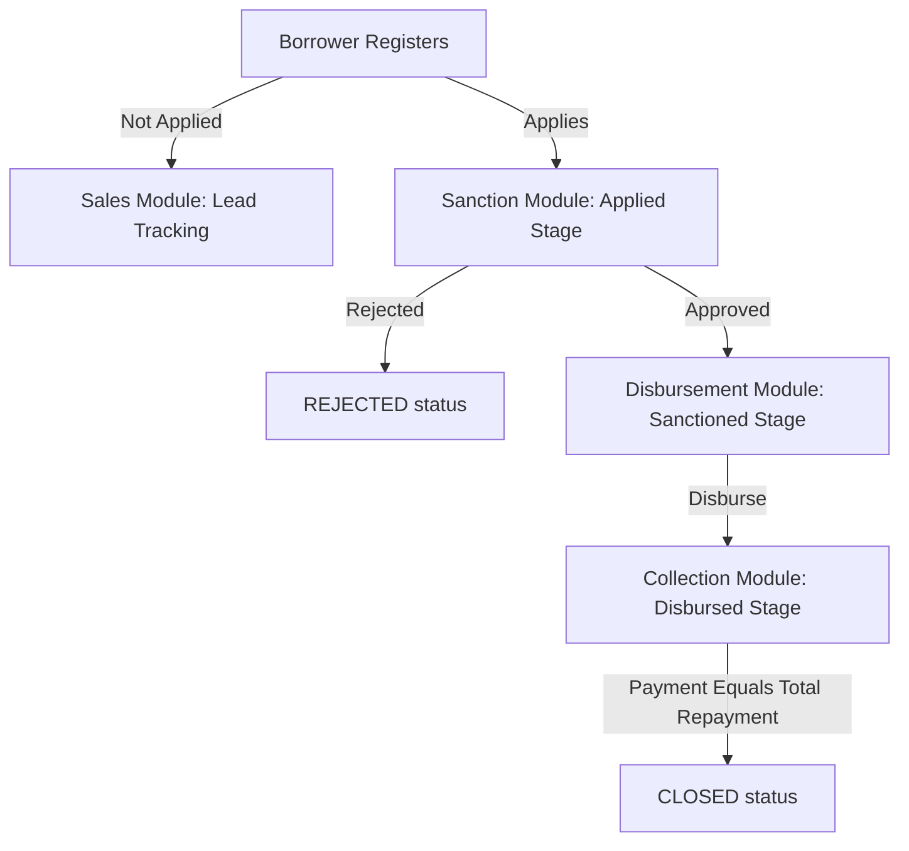

# Loan Management System (LMS)

A full-stack lending platform where borrowers can apply for loans and internal executives manage those loans through their lifecycle. This project is built using the MERN stack with Next.js (App Router), Express.js, MongoDB, and TypeScript.

---

## 🏗️ Project Architecture & Tech Stack

This repository is split into two primary components:

1. **[Backend]**: Express server in TypeScript connecting to MongoDB using Mongoose.
2. **[Frontend]**: Next.js 16 app with React, TypeScript, and Tailwind CSS.

### Tech Stack Details

- **Frontend**: Next.js 16 (App Router), React 19, TypeScript, Tailwind CSS
- **Backend**: Node.js, Express.js, TypeScript, Mongoose
- **Database**: MongoDB
- **Authentication**: JWT (JSON Web Tokens) & `bcryptjs`
- **File Uploads**: `multer` (Salary slip storage in backend `uploads/` directory)

---

## 🧭 Borrower Journey & Application Flow

The borrower application is structured as a multi-step form:

1. **Sign Up / Login**: User creates a borrower account or logs in. All routes (except auth) are protected by JWT authentication.
2. **Personal Details & Eligibility Check (BRE)**:
   The user submits their details (Full Name, PAN, DOB, Monthly Salary, and Employment Mode). Upon submission, the backend runs the **Business Rule Engine (BRE)**:
   - **Age**: Applicant must be between **23 and 50 years** old.
   - **Monthly Salary**: Must be **₹25,000** or above.
   - **PAN**: Format must match the standard Indian PAN regular expression (`/^[A-Z]{5}[0-9]{4}[A-Z]{1}$/`).
   - **Employment Status**: Applicant cannot be `unemployed`.

   If any rules fail, the application is blocked and a descriptive error is returned. If rules pass, the user is marked as eligible (`isEligible: true`) and details are saved.

3. **Upload Salary Slip**: Accepts `PDF`, `JPG`, or `PNG` files up to 5 MB.
4. **Loan Configuration & Apply**:
   Borrowers can choose a loan amount between **₹50,000 and ₹5,000,000** (5 Lakhs) and a tenure between **30 and 365 days** using sliders.
   - **Interest Rate**: Fixed at **12% p.a.**
   - **Interest Calculation**: Calculated using Simple Interest formula:
     $$\text{Simple Interest (SI)} = \frac{P \times R \times T}{365 \times 100}$$
     $$\text{Total Repayment} = P + \text{SI}$$
     _(where $P = \text{Principal Amount}$, $R = \text{Interest Rate (12\%)}$, $T = \text{Tenure in days}$)_
   - On submission, the loan is created in the database with status `APPLIED`.

---

## 💼 Operations Dashboard Modules

Executives can access the dashboard to manage loans based on their roles:



- **Sales Module**: Tracks leads (registered users who haven't completed or submitted a loan application).
- **Sanction Module**: Allows Sanction Executives to review loan applications, download/view uploaded salary slips, and either **approve** (status becomes `SANCTIONED`) or **reject** with a mandatory rejection reason (status becomes `REJECTED`).
- **Disbursement Module**: Allows Disbursement Executives to review sanctioned loans and mark them as disbursed once funds are released (status becomes `DISBURSED`).
- **Collection Module**: Allows Collection Executives to view active (`DISBURSED`) and history (`CLOSED`) loans, track outstanding balance, and record borrower payments.
  - **UTR Number Check**: Each payment must have a unique UTR number to prevent duplicates.
  - **Payment Validation**: Payment amount cannot exceed the current outstanding balance.
  - **Auto-Close**: When the sum of recorded payments equals the total repayment amount, the loan status is automatically updated to `CLOSED`.

---

## 🔐 Role-Based Access Control (RBAC)

The system enforces authorization on both the frontend layout level and backend controller routes using middleware.

- Roles: `admin`, `sales`, `sanction`, `disbursement`, `collection`, `borrower`.
- **Admin** has access to all four executive modules.
- **Executives** only have access to their designated modules.
- **Borrowers** cannot access any operations dashboard.

---

## 📁 Database Schema Details

### 1. User Schema (`User`)

Stores accounts for both borrowers and internal staff.

```typescript
{
  name: string;
  email: string;
  password: string; (hashed)
  role: 'borrower' | 'admin' | 'sales' | 'sanction' | 'disbursement' | 'collection';
  pan?: string;
  dob?: Date;
  monthlySalary?: number;
  employmentMode?: 'salaried' | 'self-employed' | 'unemployed';
  isEligible?: boolean;
}
```

### 2. Loan Schema (`Loan`)

Stores loan applications and their status tracking.

```typescript
{
  borrowerId: ObjectId (ref: 'User');
  amount: number;
  tenure: number;
  interestRate: number; (default: 12)
  totalRepayment: number;
  salarySlipUrl: string;
  status: 'APPLIED' | 'SANCTIONED' | 'REJECTED' | 'DISBURSED' | 'CLOSED';
  rejectionReason?: string;
  appliedAt?: Date;
  sanctionedAt?: Date;
  disbursedAt?: Date;
  closedAt?: Date;
}
```

### 3. Payment Schema (`Payment`)

Tracks payments recorded against disbursed loans.

```typescript
{
  loanId: ObjectId (ref: 'Loan');
  utrNumber: string; (unique, case-insensitive)
  amount: number;
  paymentDate: Date;
}
```

---

## 🚀 Setup & Installation Instructions

### Prerequisites

- Node.js (v18 or higher recommended)
- MongoDB installed locally or a MongoDB Atlas URI

### 1. Backend Setup

1. Navigate to the backend directory:
   ```bash
   cd backend
   ```
2. Install dependencies:
   ```bash
   npm install
   ```
3. Create a `.env` file from the example:
   ```bash
   cp .env.example .env
   ```
4. Fill in the environment variables in `.env`:
   ```env
   PORT=5000
   MONGO_URI=mongodb://localhost:27017/lms
   JWT_SECRET=your_super_secret_key
   JWT_EXPIRES_IN=7d
   ```
5. **Seed the database** (pre-creates executive accounts and test borrower credentials):
   ```bash
   npm run seed
   ```
6. Run the backend development server:
   ```bash
   npm run dev
   ```

### 2. Frontend Setup

1. Navigate to the frontend directory:
   ```bash
   cd ../frontend
   ```
2. Install dependencies:
   ```bash
   npm install
   ```
3. Verify or configure `.env.local`:
   ```env
   NEXT_PUBLIC_API_URL=http://localhost:5000/api
   ```
4. Run the frontend development server:
   ```bash
   npm run dev
   ```
5. Open your browser and navigate to `http://localhost:3000`.

---

## 🔑 Seed Login Credentials

Use these credentials to log in and test each role immediately (created automatically by `npm run seed`):

| Role                       | Email                  | Password          | Access / Dashboard Modules                              |
| :------------------------- | :--------------------- | :---------------- | :------------------------------------------------------ |
| **Admin**                  | `admin@lms.com`        | `admin123`        | All modules (Sales, Sanction, Disbursement, Collection) |
| **Sales Executive**        | `sales@lms.com`        | `sales123`        | Sales module (Lead tracking)                            |
| **Sanction Executive**     | `sanction@lms.com`     | `sanction123`     | Sanction module (Approve/Reject loans)                  |
| **Disbursement Executive** | `disbursement@lms.com` | `disbursement123` | Disbursement module (Disburse loans)                    |
| **Collection Executive**   | `collection@lms.com`   | `collection123`   | Collection module (Record payments)                     |
| **Borrower**               | `borrower@lms.com`     | `borrower123`     | Borrower loan application portal                        |
